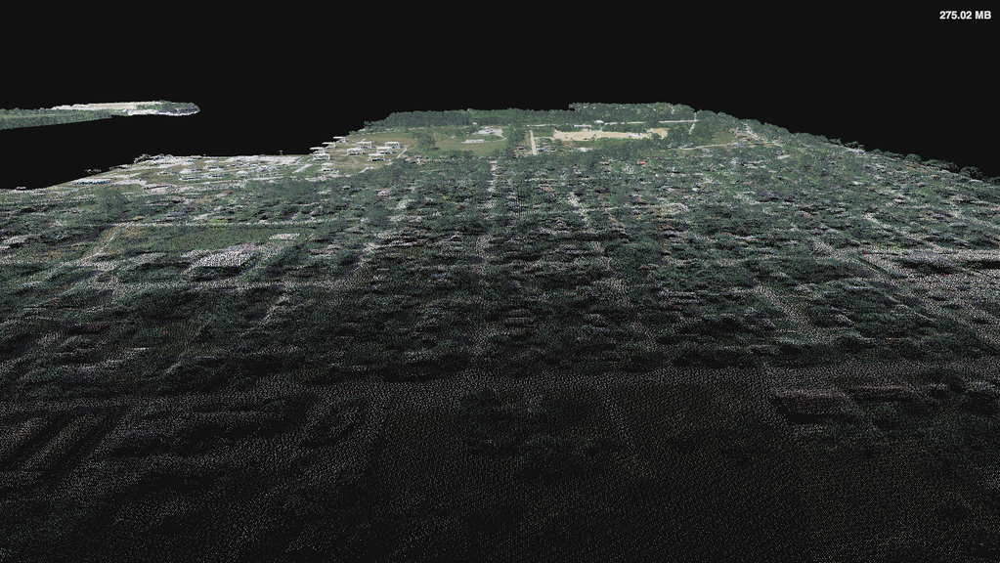

# GREYHOUND

A pointcloud querying and streaming framework over websockets for the web and your native apps.

# Tell me more
_Greyhound_ is powered by [PDAL](http://www.pointcloud.org/) in the background which it uses to query points out of a point cloud source. The queries flow through a variety of systems put in place for scalability and session management.  PDAL sessions are maintained in stand-alone binaries which exist for as long as sessions are active.  See the [client documentation](https://github.com/hobu/greyhound/blob/master/doc/clientDevelopment.rst) and the [administrator documentation](https://github.com/hobu/greyhound/blob/master/doc/administration.rst) for more details on development and deployment.

A json-over-websockets protocol is used to initiate a session and query points.  Point data is streamed as binary data from the server.  See the _examples_ directory on how to query and read data, and how to store pipelines within _Greyhound_.

## The magic
Greyhound allows a client to selectively stream point cloud data without a large up-front download cost.  This is accomplished via Greyhound's internal indexing methods.  Here's an example of the results you can get by downloading only a small percentage of a moderately sized point cloud file.

| Query              | Size       | Download ratio | Download time at 50Mb/s    |
|--------------------|------------|----------------|----------------------------|
| ``rasterize = 9``  | 3.41 MB    | 2.14%          | 0.55 seconds               |
| ``rasterize = 10`` | 13.63 MB   | 8.57%          | 2.18 seconds               |
| All points         | 159.09 MB  | 100%           | 25.45 seconds              |

And here is an animation showing what you get with these small downloads compared with the full resolution download:

So a rendering client backed by _Greyhound_ can give near-immediate feedback to a viewer, and selectively fetch more details as the user navigates the point cloud.  All in real-time, and without ever needing to wait for a large download.

# How to hack?
You will need [Vagrant](http://www.vagrantup.com/) installed to play with _Greyhound_.  Once you check out the source code, browse to the checked out directory and do a:

	vagrant up

This will start the virtual machine and launch _Greyhound_.  The first time you do it, it may take a while to set up the virtual machine with all the needed components (some installed from ubuntu repos, some built manually).

_Greyhound_ allows clients to make use of pipelines that have been previously stored within the _Greyhound_ database as their pointcloud source.  These pipelines must be placed into the database before they may be used, and then selected with the ID that _Greyhound_ assigns.  The database is pre-initialized with a sample pipeline during the `vagrant up` procedure.  To have pointcloud data immediately rendered in a browser once the process finishes, you can navigate to:

- [http://localhost:8080/data/58a6ee2c990ba94db936d56bd42aa703](http://localhost:8080/data/58a6ee2c990ba94db936d56bd42aa703)

_Greyhound_ also supports some spatially indexed queries via URL query parameters (these links operate on a large pipeline):

- [Point-radius query](http://localhost:8080/data/3c51e54a3f0e1b7f4ffd582d4d970162?radius=400&geo={%22type%22:%22Point%22,%22coordinates%22:[276488.2105233709,4179808.998997613,2029.596267072244]})
- [BBox and quadtree search depth query](http://localhost:8080/data/3c51e54a3f0e1b7f4ffd582d4d970162?geo={%22bbox%22:[276400,4179000,277100,4179700]}&depthEnd=10)
- [Quad-tree single-level raster](http://localhost:8080/data/3c51e54a3f0e1b7f4ffd582d4d970162?rasterize=9)
- [Custom resolution bounded raster](http://localhost:8080/data/3c51e54a3f0e1b7f4ffd582d4d970162?geo={%22bbox%22:[276400,4179000,277100,4179700]}&resolution=[256,256])

## Going further
To get more functionality than looking at the sample point clouds in your browser, you'll need to SSH into your Vagrant machine with:

	vagrant ssh

Once you are connected to the virtual machine, you have control over the _Greyhound_ stack with:

- `greyhound start`  Start all _Greyhound_ components.
- `greyhound stop`   Stop all _Greyhound_ components.
- `greyhound status` View port status of all running _Greyhound_ components.

When _Greyhound_ services are running, you can try out the sample C++ client code (all commands operate on the sample pipeline if no argument is provided) or run the unit tests to verify the integrity of your Greyhound stack:

- `./examples/cpp/put-pipeline [/path/to/pipeline.xml]` Write the chosen pipeline into the _Greyhound_ database.  The assigned _Greyhound_ ID will be printed to stdout.
- `./examples/cpp/get-points [GreyhoundPipelineId]`     Get points specified by the chosen pipeline ID.
- `nodeunit test/unit.js`                               Run all _Greyhound_ unit tests.

# License
_Greyhound_ is under **MIT** license and is Copyright [Howard Butler](http://hobu.co), [Uday Verma](https://github.com/verma), and [Connor Manning](https://github.com/connormanning).

