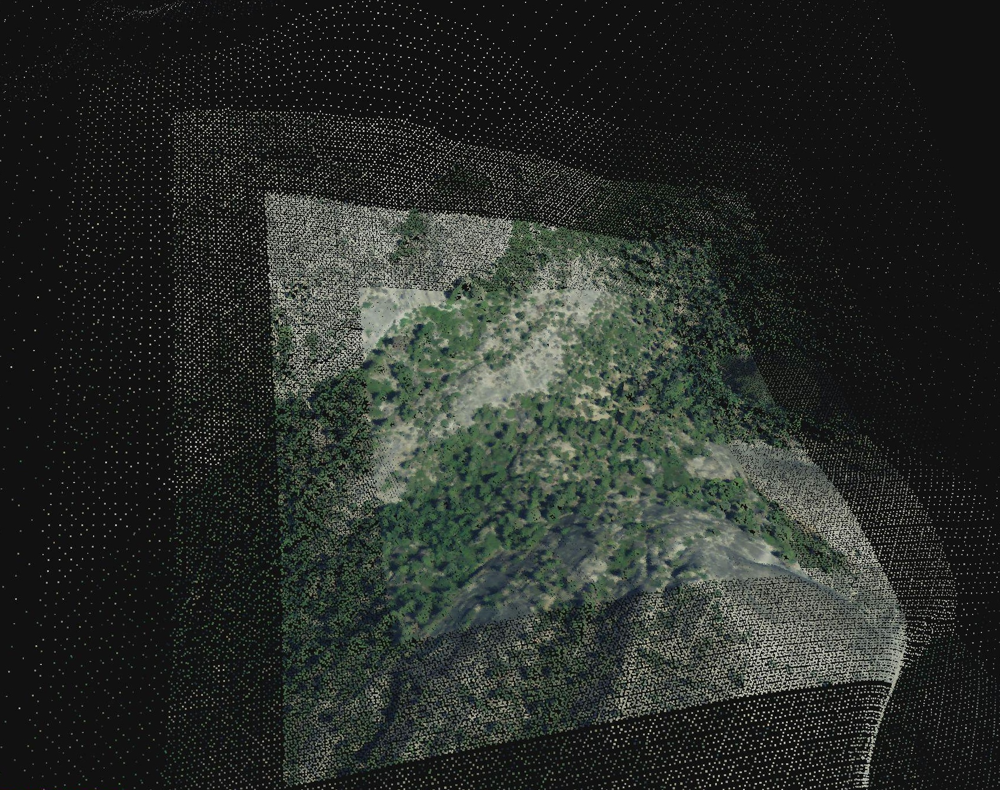
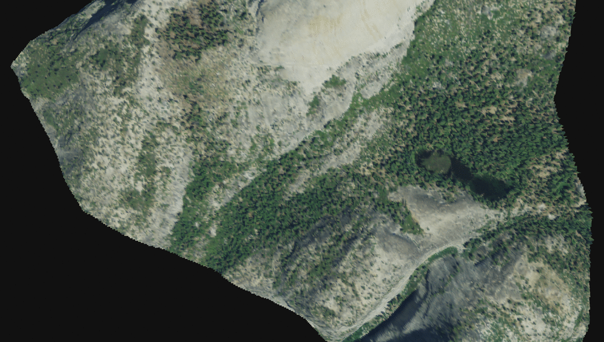

===============================================================================
Greyhound - Client Development
===============================================================================

:author: Connor Manning
:email: connor@hobu.co
:date: 09/30/2014

Overview
===============================================================================

Greyhound is a distributed server architecture that abstracts and maintains persistent sessions for PDAL pipelines used for real-time querying of point cloud data.

Using Greyhound
-------------------------------------------------------------------------------

Greyhound operates via `WebSocket`_ connections, so usage begins by opening a WebSocket connection to Greyhound's URL and port.

Command-and-response exchanges are issued via stringified `JSON`_ objects over the WebSocket connection.  Every Greyhound command has an associated response.

The first action by a client is to create a session, which activates a PDAL pipeline that is stored on the server and issues the client a session token.  This token is used for all further interaction with this session.  After creation, the client can perform various commands like fetching statistics on the point cloud, gathering other metadata, or issuing real-time indexed read queries.

When a session is no longer needed, it is destroyed by the client and the WebSocket connection is closed.

.. _`WebSocket`: http://en.wikipedia.org/wiki/WebSocket
.. _`JSON`: http://json.org/

API
===============================================================================

Command Set
-------------------------------------------------------------------------------

+---------------+-------------------------------------------------------------+
| Command       | Function                                                    |
+===============+=============================================================+
| put           | Store a pipeline.                                           |
+---------------+-------------------------------------------------------------+
| create        | Create a PDAL session using a previously stored pipeline.   |
+---------------+-------------------------------------------------------------+
| serialize     | Request serialization of an indexed PDAL session.           |
+---------------+-------------------------------------------------------------+
| pointsCount   | Get the number of points present in a session.              |
+---------------+-------------------------------------------------------------+
| schema        | Get the Greyhound schema of a session.                      |
+---------------+-------------------------------------------------------------+
| stats         | Get the PDAL statistics for this session's pipeline.        |
+---------------+-------------------------------------------------------------+
| srs           | Get the spatial reference system of a session.              |
+---------------+-------------------------------------------------------------+
| fills         | Get the quad tree depth and number of points per depth.     |
+---------------+-------------------------------------------------------------+
| read          | Read points from a session.                                 |
+---------------+-------------------------------------------------------------+
| cancel        | Cancel an ongoing 'read' command.                           |
+---------------+-------------------------------------------------------------+
| destroy       | Destroy an active session.                                  |
+---------------+-------------------------------------------------------------+

|

Command and Response format
-------------------------------------------------------------------------------

Greyhound commands are issued as JSON objects over a WebSocket connection, and every command sent to Greyhound will initiate a JSON response.  Strings are UTF-8 encoded, and all commands are case sensitive.

Parentheses ``()`` around a key indicate optional or conditional keys that will not necessarily be present.  Quotation marks ``""`` around a field indicate a string literal, as opposed to a description.

Each command shares a common basic format:

+------------------------------------------------------------------------------------+
| Command                                                                            |
+---------------------+-------------+------------------------------------------------+
| Key                 | Type        | Value                                          |
+=====================+=============+================================================+
| ``"command"``       | String      | Command name                                   |
+---------------------+-------------+------------------------------------------------+
| (command parameters)| Various     | Command-dependent values                       |
+---------------------+-------------+------------------------------------------------+

|

Greyhound only transmits data in response to a command, and does not send any transmissions unprompted.  Responses also share a common format:

+-----------------------------------------------------------------------------------------+
| Response                                                                                |
+-----------------------+--------------+--------------------------------------------------+
| Key                   | Type         | Value                                            |
+=======================+==============+==================================================+
| ``"command"``         | String       | Command name received in initial command         |
+-----------------------+--------------+--------------------------------------------------+
| ``"status"``          | Integer      | ``1`` for success, else ``0``                    |
+-----------------------+--------------+--------------------------------------------------+
| (``"message"``)       | String       | Information message regarding this command       |
+-----------------------+--------------+--------------------------------------------------+
| (``"reason"``)        | String       | Notification of a problem with this command      |
+-----------------------+--------------+--------------------------------------------------+
| (response parameters) | Various      | Command-dependent values                         |
+-----------------------+--------------+--------------------------------------------------+

|

If the returning ``status`` field is ``0``, then ``reason`` will contain an error message if applicable.  If the returning ``status`` is zero, then there are no valid command-dependent response parameters.

There is only one exception to this command-and-response format, which occurs only for the ``read`` command, which includes a binary transmission following the traditional JSON response.  This scenario is the only non-JSON output from Greyhound.  See `Read (basics)`_ for details.

Command Details
-------------------------------------------------------------------------------

Put
~~~~~~~~~~~~~~~~~~~~~~~~~~~~~~~~~~~~~~~~~~~~~~~~~~~~~~~~~~~~~~~~~~~~~~~~~~~~~~~

+-------------------------------------------------------------------------------------+
| Command                                                                             |
+-------------------+------------+----------------------------------------------------+
| Key               | Type       | Value                                              |
+===================+============+====================================================+
| ``"command"``     | String     | ``"put"``                                          |
+-------------------+------------+----------------------------------------------------+
| ``"pipeline"``    | String     | PDAL pipeline XML                                  |
+-------------------+------------+----------------------------------------------------+

+-------------------------------------------------------------------------------------+
| Response                                                                            |
+-------------------+------------+----------------------------------------------------+
| Key               | Type       | Value                                              |
+===================+============+====================================================+
| ``"command"``     | String     | ``"put"``                                          |
+-------------------+------------+----------------------------------------------------+
| ``"status"``      | Integer    | ``1`` for success, else ``0``                      |
+-------------------+------------+----------------------------------------------------+
| ``"pipelineId"``  | String     | Greyhound pipeline ID                              |
+-------------------+------------+----------------------------------------------------+

Notes:
 - ``pipeline``: must contain valid PDAL XML, which will be validated before storage.  If the pipeline XML is not valid, the returning ``status`` will be ``0`` and the pipeline will not be stored.  A pipeline must contain at least ``X``, ``Y``, and ``Z`` PDAL Dimensions to be considered valid.
 - ``pipelineId``: used in the future to instantiate a PDAL session for this pipeline.  A given pipeline XML string will always return the same ``pipelineId`` value.

----

Create
~~~~~~~~~~~~~~~~~~~~~~~~~~~~~~~~~~~~~~~~~~~~~~~~~~~~~~~~~~~~~~~~~~~~~~~~~~~~~~~

+-------------------------------------------------------------------------------+
| Command                                                                       |
+-----------------+------------+------------------------------------------------+
| Key             | Type       | Value                                          |
+=================+============+================================================+
| ``"command"``   | String     | ``"create"``                                   |
+-----------------+------------+------------------------------------------------+
| ``"pipelineId"``| String     | Greyhound pipeline ID                          |
+-----------------+------------+------------------------------------------------+

+-------------------------------------------------------------------------------------+
| Response                                                                            |
+-------------------+------------+----------------------------------------------------+
| Key               | Type       | Value                                              |
+===================+============+====================================================+
| ``"command"``     | String     | ``"create"``                                       |
+-------------------+------------+----------------------------------------------------+
| ``"status"``      | Integer    | ``1`` for success, else ``0``                      |
+-------------------+------------+----------------------------------------------------+
| ``"session"``     | String     | Greyhound session ID                               |
+-------------------+------------+----------------------------------------------------+

Notes:
 - ``pipelineId``: stored from the results of a previous ``put`` command.  If the given ``pipelineId`` does not exist within Greyhound, then the returning ``status`` will be ``0``.
 - ``session``: represents a token required for future use of this session.  All Greyhound commands except for ``put`` and ``create`` require an active Greyhound session token as a parameter.

----

Serialize
~~~~~~~~~~~~~~~~~~~~~~~~~~~~~~~~~~~~~~~~~~~~~~~~~~~~~~~~~~~~~~~~~~~~~~~~~~~~~~~

+-----------------------------------------------------------------------------+
| Command                                                                     |
+---------------+------------+------------------------------------------------+
| Key           | Type       | Value                                          |
+===============+============+================================================+
| ``"command"`` | String     | ``"serialize"``                                |
+---------------+------------+------------------------------------------------+
| ``"session"`` | String     | Greyhound session ID                           |
+---------------+------------+------------------------------------------------+

+-------------------------------------------------------------------------------------+
| Response                                                                            |
+-------------------+------------+----------------------------------------------------+
| Key               | Type       | Value                                              |
+===================+============+====================================================+
| ``"command"``     | String     | ``"serialize"``                                    |
+-------------------+------------+----------------------------------------------------+
| ``"status"``      | Integer    | ``1`` for success, else ``0``                      |
+-------------------+------------+----------------------------------------------------+

Notes:
 - This command batches a background task to serialize the pipeline for instantaneous reinitialization at a later time.
 - The ``status`` in the response indicates whether the task was successfully batched for processing, not necessarily that the serialization is complete - for which there is no further indication.  The session may still be used as usual after this command.
 - The serialized file may be written in a compressed format depending on Greyhound's configuration settings.
 - If the PDAL session has not yet been quad-indexed, this command will create the quad-index.  The response will not come back until this indexing has completed successfully.

----

Points Count
~~~~~~~~~~~~~~~~~~~~~~~~~~~~~~~~~~~~~~~~~~~~~~~~~~~~~~~~~~~~~~~~~~~~~~~~~~~~~~~

+-----------------------------------------------------------------------------+
| Command                                                                     |
+---------------+------------+------------------------------------------------+
| Key           | Type       | Value                                          |
+===============+============+================================================+
| ``"command"`` | String     | ``"pointsCount"``                              |
+---------------+------------+------------------------------------------------+
| ``"session"`` | String     | Greyhound session ID                           |
+---------------+------------+------------------------------------------------+

+-------------------------------------------------------------------------------------+
| Response                                                                            |
+-------------------+------------+----------------------------------------------------+
| Key               | Type       | Value                                              |
+===================+============+====================================================+
| ``"command"``     | String     | ``"pointsCount"``                                  |
+-------------------+------------+----------------------------------------------------+
| ``"status"``      | Integer    | ``1`` for success, else ``0``                      |
+-------------------+------------+----------------------------------------------------+
| ``"count"``       | Integer    | Number of points in this session                   |
+-------------------+------------+----------------------------------------------------+

----

Schema
~~~~~~~~~~~~~~~~~~~~~~~~~~~~~~~~~~~~~~~~~~~~~~~~~~~~~~~~~~~~~~~~~~~~~~~~~~~~~~~

+-----------------------------------------------------------------------------+
| Command                                                                     |
+---------------+------------+------------------------------------------------+
| Key           | Type       | Value                                          |
+===============+============+================================================+
| ``"command"`` | String     | ``"schema"``                                   |
+---------------+------------+------------------------------------------------+
| ``"session"`` | String     | Greyhound session ID                           |
+---------------+------------+------------------------------------------------+

+-----------------------------------------------------------------------------------------+
| Response                                                                                |
+-------------------+------------+--------------------------------------------------------+
| Key               | Type       | Value                                                  |
+===================+============+========================================================+
| ``"command"``     | String     | ``"pointsCount"``                                      |
+-------------------+------------+--------------------------------------------------------+
| ``"status"``      | Integer    | ``1`` for success, else ``0``                          |
+-------------------+------------+--------------------------------------------------------+
| ``"schema"``      | Object     | JSON stringified Greyhound schema for this session     |
+-------------------+------------+--------------------------------------------------------+

Notes:
 - ``schema``: see `Session Schema`_.

----

Stats
~~~~~~~~~~~~~~~~~~~~~~~~~~~~~~~~~~~~~~~~~~~~~~~~~~~~~~~~~~~~~~~~~~~~~~~~~~~~~~~

+-----------------------------------------------------------------------------+
| Command                                                                     |
+---------------+------------+------------------------------------------------+
| Key           | Type       | Value                                          |
+===============+============+================================================+
| ``"command"`` | String     | ``"stats"``                                    |
+---------------+------------+------------------------------------------------+
| ``"session"`` | String     | Greyhound session ID                           |
+---------------+------------+------------------------------------------------+

+-----------------------------------------------------------------------------------------+
| Response                                                                                |
+-------------------+------------+--------------------------------------------------------+
| Key               | Type       | Value                                                  |
+===================+============+========================================================+
| ``"command"``     | String     | ``"pointsCount"``                                      |
+-------------------+------------+--------------------------------------------------------+
| ``"status"``      | Integer    | ``1`` for success, else ``0``                          |
+-------------------+------------+--------------------------------------------------------+
| ``"stats"``       | Object     | JSON stringified PDAL statistics for this session.     |
+-------------------+------------+--------------------------------------------------------+

Notes:
 - ``stats``: the format of this object is determined by PDAL, and is dependent on the `PDAL Stages`_ in the pipeline.  Greyhound inserts a PDAL Stats Filter into each pipeline.  This is the only PDAL Stage guaranteed to exist, and its contents are accessible via ``stats.stages['filters.stats'].statistic``.  This object contains various statistics on each dimension, like minimums, maximums, and averages.

.. _`PDAL Stages`: http://www.pdal.io/stages/index.html

----

Spatial Reference System
~~~~~~~~~~~~~~~~~~~~~~~~~~~~~~~~~~~~~~~~~~~~~~~~~~~~~~~~~~~~~~~~~~~~~~~~~~~~~~~

+-----------------------------------------------------------------------------+
| Command                                                                     |
+---------------+------------+------------------------------------------------+
| Key           | Type       | Value                                          |
+===============+============+================================================+
| ``"command"`` | String     | ``"srs"``                                      |
+---------------+------------+------------------------------------------------+
| ``"session"`` | String     | Greyhound session ID                           |
+---------------+------------+------------------------------------------------+

+-----------------------------------------------------------------------------------------+
| Response                                                                                |
+-------------------+------------+--------------------------------------------------------+
| Key               | Type       | Value                                                  |
+===================+============+========================================================+
| ``"command"``     | String     | ``"srs"``                                              |
+-------------------+------------+--------------------------------------------------------+
| ``"status"``      | Integer    | ``1`` for success, else ``0``                          |
+-------------------+------------+--------------------------------------------------------+
| ``"srs"``         | String     | Spatial reference system for this session              |
+-------------------+------------+--------------------------------------------------------+

Notes:
 - ``srs``: a string formatted by PDAL representing the spatial reference system.

----

Quad-Tree Fills
~~~~~~~~~~~~~~~~~~~~~~~~~~~~~~~~~~~~~~~~~~~~~~~~~~~~~~~~~~~~~~~~~~~~~~~~~~~~~~~

+-----------------------------------------------------------------------------+
| Command                                                                     |
+---------------+------------+------------------------------------------------+
| Key           | Type       | Value                                          |
+===============+============+================================================+
| ``"command"`` | String     | ``"fills"``                                    |
+---------------+------------+------------------------------------------------+
| ``"session"`` | String     | Greyhound session ID                           |
+---------------+------------+------------------------------------------------+

+---------------------------------------------------------------------------------------------+
| Response                                                                                    |
+-------------------+----------------+--------------------------------------------------------+
| Key               | Type           | Value                                                  |
+===================+================+========================================================+
| ``"command"``     | String         | ``"srs"``                                              |
+-------------------+----------------+--------------------------------------------------------+
| ``"status"``      | Integer        | ``1`` for success, else ``0``                          |
+-------------------+----------------+--------------------------------------------------------+
| ``"fills"``       | Array[Integer] | Array of points per depth of each quad-tree level      |
+-------------------+----------------+--------------------------------------------------------+

Notes:
 - ``fills``: The array length of ``fills`` represents the depth of the quad-tree.  ``fills[n]`` represents the number of points at the ``nth`` level of the quad-tree.  Issuing this command will initiate the building of the quad-tree index if it has not yet been built.

----

Read (Basics)
~~~~~~~~~~~~~~~~~~~~~~~~~~~~~~~~~~~~~~~~~~~~~~~~~~~~~~~~~~~~~~~~~~~~~~~~~~~~~~~

+----------------------------------------------------------------------------------------+
| Command                                                                                |
+---------------------+------------+-----------------------------------------------------+
| Key                 | Type       | Value                                               |
+=====================+============+=====================================================+
| ``"command"``       | String     | ``"read"``                                          |
+---------------------+------------+-----------------------------------------------------+
| ``"session"``       | String     | Greyhound session ID                                |
+---------------------+------------+-----------------------------------------------------+
| (``"schema"``)      | String     | JSON stringified schema for return data             |
+---------------------+------------+-----------------------------------------------------+
| (``"compress"``)    | Boolean    | If true, output stream will be compressed           |
+---------------------+------------+-----------------------------------------------------+

Notes:
 - ``schema``: If omitted, ``read`` results will be formatted as the schema returned from `Schema`_.  Client may optionally supply a different schema format for the results of this ``read``.  See `Manipulating the Schema`_.
 - ``compress``: If true, ``read`` the resulting stream will be compressed with `Laz-Perf`_.  The ``schema`` parameter, if provided, is respected by the compressed stream.

|

Important:
 - If ``compress`` is specified, the ``numBytes`` field in the Response below still refers to uncompressed bytes.  Therefore the actual data size streamed to the client from Greyhound will be less than specified by ``numBytes``.  A client will not know in advance the actual number of bytes that will be streamed, so a client should decompress the results as they arrive and compare the uncompressed results to the expected values from the Response.

.. _`Laz-Perf`: http://github.com/verma/laz-perf

|

+-----------------------------------------------------------------------------------------+
| Response                                                                                |
+-------------------+------------+--------------------------------------------------------+
| Key               | Type       | Value                                                  |
+===================+============+========================================================+
| ``"command"``     | String     | ``"read"``                                             |
+-------------------+------------+--------------------------------------------------------+
| ``"status"``      | Integer    | ``1`` for success, else ``0``                          |
+-------------------+------------+--------------------------------------------------------+
| ``"readId"``      | String     | Identification token for this ``read`` request         |
+-------------------+------------+--------------------------------------------------------+
| ``"numPoints"``   | Integer    | Number of points that will be transmitted - may be zero|
+-------------------+------------+--------------------------------------------------------+
| ``"numBytes"``    | Integer    | Number of bytes that will be transmitted - may be zero |
+-------------------+------------+--------------------------------------------------------+

Notes:
 - ``readId``: This identification string is required to cancel this ``read`` request (see `Cancel`_).
 - ``numPoints``: Number of points that will follow in a binary transmission.
 - ``numBytes``: Number of bytes that will follow in a binary transmission.

After Greyhound transmits the above JSON response, if ``numBytes`` is non-zero, a binary transmission sequence will follow.  This binary data will arrive in the format specified by ``schema`` (see `Schema`_) if one is supplied as a parameter to ``read``, or as the default returned by the ``schema`` query.

If ``numBytes`` is non-zero (and ``status`` is ``1``), a client should expect to consume ``numBytes`` bytes of binary data.  After ``numBytes`` of binary data is has arrived, the ``read`` response is complete.

|

Important:
 - Because binary data from multiple ``read`` commands cannot be differentiated, no new ``read`` command should be issued over a single websocket connection until a previous ``read`` query completes or is successfully cancelled.  All other commands may still be issued during this time period.
 - There is no further response from Greyhound to indicate that a ``read`` transmission is complete, so a client must take note of ``numBytes`` and track the number of binary bytes received accordingly.
 - Binary data may arrive in multiple "chunked" transmissions.  Chunk size may vary, even within the same response sequence.  Chunks will always arrive in order and may be appended together by a client.  Chunk boundaries may not align with point or dimension boundaries, so a single point, or even a single dimension within a point, may be spread across multiple chunks.

----

Read (Raster Basics)
~~~~~~~~~~~~~~~~~~~~~~~~~~~~~~~~~~~~~~~~~~~~~~~~~~~~~~~~~~~~~~~~~~~~~~~~~~~~~~~

+-----------------------------------------------------------------------------------------+
| Response                                                                                |
+-------------------+------------+--------------------------------------------------------+
| Key               | Type       | Value                                                  |
+===================+============+========================================================+
| ``"command"``     | String     | ``"read"``                                             |
+-------------------+------------+--------------------------------------------------------+
| ``"status"``      | Integer    | ``1`` for success, else ``0``                          |
+-------------------+------------+--------------------------------------------------------+
| ``"readId"``      | String     | Identification token for this ``read`` request         |
+-------------------+------------+--------------------------------------------------------+
| ``"numPoints"``   | Integer    | Number of points that will be transmitted - may be zero|
+-------------------+------------+--------------------------------------------------------+
| ``"numBytes"``    | Integer    | Number of bytes that will be transmitted - may be zero |
+-------------------+------------+--------------------------------------------------------+
| ``"rasterMeta"``  | Object     | Raster dimensional metadata                            |
+-------------------+------------+--------------------------------------------------------+

Notes:
 - The initial response is the same as the response for non-rasterized queries, with the addition of the ``rasterMeta`` JSON object.  The binary data is formatted differently from non-rasterized ``read`` queries (see below).
 - If a ``schema`` parameter is included in the rastered ``read`` command, then it must contain ``X``, ``Y``, and at least one other dimension.

|

``rasterMeta`` contains information about the dimensions of the raster:

+-----------------------------------------------------------------------------------------+
| ``rasterMeta``                                                                          |
+-------------------+------------+--------------------------------------------------------+
| Key               | Type       | Value                                                  |
+===================+============+========================================================+
| ``"xMin"``        | Float      | Lower X bound                                          |
+-------------------+------------+--------------------------------------------------------+
| ``"xStep"``       | Float      | X value difference between adjacent coordinate entries |
+-------------------+------------+--------------------------------------------------------+
| ``"xNum"``        | Integer    | Number of steps in the X direction                     |
+-------------------+------------+--------------------------------------------------------+
| ``"yMin"``        | Float      | Lower Y bound                                          |
+-------------------+------------+--------------------------------------------------------+
| ``"yStep"``       | Float      | Y value difference between adjacent coordinate entries |
+-------------------+------------+--------------------------------------------------------+
| ``"yNum"``        | Integer    | Number of steps in the Y direction                     |
+-------------------+------------+--------------------------------------------------------+

The format of the binary transmission following the initial response follows the information in ``rasterMeta``.  Starting at offset ``0``, the first bytes of the binary data represent coordinate ``(xMin, yMin)``.  At offset ``0 + <reduced schema size>``, where ``reduced schema size`` is the schema size excluding ``X`` and ``Y`` values, the coordinate represented is ``(xMin + xStep, yMin)``.  After an offset of ``xNum * <reduced schema size>``, the represented ``Y`` coordinate increments by ``yStep``.  See `Raster Metadata`_ for further information.

Important:
 - Each point in the rasterized binary format does not explicitly contain ``X`` and ``Y`` dimension values.  These values are implicit from the information in ``rasterMeta``.
 - Therefore the size of each point in the binary schema does not include the sizes of ``X`` or ``Y``.  In the ``schema`` parameter sent with the ``read`` command, the ``size`` and ``type`` of these dimensions may be omitted, and will be ignored if included.

----

Read - Unindexed
~~~~~~~~~~~~~~~~~~~~~~~~~~~~~~~~~~~~~~~~~~~~~~~~~~~~~~~~~~~~~~~~~~~~~~~~~~~~~~~

+----------------------------------------------------------------------------------------+
| Command                                                                                |
+---------------------+------------+-----------------------------------------------------+
| Key                 | Type       | Value                                               |
+=====================+============+=====================================================+
| ``"command"``       | String     | ``"read"``                                          |
+---------------------+------------+-----------------------------------------------------+
| ``"session"``       | String     | Greyhound session ID                                |
+---------------------+------------+-----------------------------------------------------+
| (``"schema"``)      | String     | JSON stringified schema for return data             |
+---------------------+------------+-----------------------------------------------------+
| (``"start"``)       | Integer    | Starting offset from which to read                  |
+---------------------+------------+-----------------------------------------------------+
| (``"count"``)       | Integer    | Number of points to read sequentially from ``start``|
+---------------------+------------+-----------------------------------------------------+

Notes:
 - See `Read (Basics)`_ for information on the Greyhound response.
 - ``start``: If omitted or negative, defaults to zero.  If greater than or equal to the value returned by `Points Count`_, no points will be read.
 - ``count``: If omitted or negative, reads from ``start`` through the last point.  If the sum of ``start`` and ``count`` is greater than or equal to the value returned by `Points Count`_, the ``read`` will read from ``start`` through the last point.
 - A client that simply wants to duplicate the entire buffer may issue a ``read`` with only the ``command`` and ``session`` parameters to read all points in their native dimenion formats.

----

Read - Quad-Tree Indexed Points
~~~~~~~~~~~~~~~~~~~~~~~~~~~~~~~~~~~~~~~~~~~~~~~~~~~~~~~~~~~~~~~~~~~~~~~~~~~~~~~

+----------------------------------------------------------------------------------------+
| Command                                                                                |
+---------------------+------------+-----------------------------------------------------+
| Key                 | Type       | Value                                               |
+=====================+============+=====================================================+
| ``"command"``       | String     | ``"read"``                                          |
+---------------------+------------+-----------------------------------------------------+
| ``"session"``       | String     | Greyhound session ID                                |
+---------------------+------------+-----------------------------------------------------+
| (``"schema"``)      | String     | JSON stringified schema for return data             |
+---------------------+------------+-----------------------------------------------------+
| (``"bbox"``)        | Float[4]   | Bounding box to query                               |
+---------------------+------------+-----------------------------------------------------+
| (``"depthBegin"``)  | Integer    | Minimum quad tree depth from which to include points|
+---------------------+------------+-----------------------------------------------------+
| (``"depthEnd"``)    | Integer    | Quad-tree depth from which only points *less* than  |
|                     |            | this level will be included                         |
+---------------------+------------+-----------------------------------------------------+

Notes:
 - See `Read (Basics)`_ for information on the Greyhound response.
 - ``bbox``: Formatted as ``[xMin, yMin, xMax, yMax]``.  If omitted, returns points from the entire set.
 - ``depthBegin``: If omitted, defaults to zero.
 - ``depthEnd``: If omitted, then every tree level greater than or equal to ``depthBegin`` is included.
 - This query requires a quad-tree index to be created prior to reading, so the first quad-tree indexed ``read`` may take longer than usual to complete.  This may be completed in advance by Greyhound due to internal session sharing.
 - See `Taking Advantage of Indexing`_ for information on leveraging the quad-tree index.

----

Read - Quad-Tree Indexed Raster
~~~~~~~~~~~~~~~~~~~~~~~~~~~~~~~~~~~~~~~~~~~~~~~~~~~~~~~~~~~~~~~~~~~~~~~~~~~~~~~

+----------------------------------------------------------------------------------------+
| Command                                                                                |
+---------------------+------------+-----------------------------------------------------+
| Key                 | Type       | Value                                               |
+=====================+============+=====================================================+
| ``"command"``       | String     | ``"read"``                                          |
+---------------------+------------+-----------------------------------------------------+
| ``"session"``       | String     | Greyhound session ID                                |
+---------------------+------------+-----------------------------------------------------+
| (``"schema"``)      | String     | JSON stringified schema for return data             |
+---------------------+------------+-----------------------------------------------------+
| ``"rasterize"``     | Integer    | Quad-tree level to rasterize                        |
+---------------------+------------+-----------------------------------------------------+

Notes:
 - See `Read (Raster Basics)`_ for information on the Greyhound response.
 - This query requires a quad-tree index to be created prior to reading, so the first quad-tree indexed ``read`` may take longer than usual to complete.  This may be completed in advance by Greyhound due to internal session sharing.

Important:
 - Results are in raster format.

----

Read - Generic Raster
~~~~~~~~~~~~~~~~~~~~~~~~~~~~~~~~~~~~~~~~~~~~~~~~~~~~~~~~~~~~~~~~~~~~~~~~~~~~~~~

+-------------------------------------------------------------------------------------------+
| Command                                                                                   |
+---------------------+---------------+-----------------------------------------------------+
| Key                 | Type          | Value                                               |
+=====================+===============+=====================================================+
| ``"command"``       | String        | ``"read"``                                          |
+---------------------+---------------+-----------------------------------------------------+
| ``"session"``       | String        | Greyhound session ID                                |
+---------------------+---------------+-----------------------------------------------------+
| (``"schema"``)      | String        | JSON stringified schema for return data             |
+---------------------+---------------+-----------------------------------------------------+
| ``"bbox"``          | Float[4]      | Bounding box to query                               |
+---------------------+---------------+-----------------------------------------------------+
| ``"resolution"``    | Integer[2]    | Resolution of the returned raster                   |
+---------------------+---------------+-----------------------------------------------------+

Notes:
 - See `Read (Raster Basics)`_ for information on the Greyhound response.
 - ``bbox``: Formatted as ``[xMin, yMin, xMax, yMax]``.
 - ``resolution``: Formatted as ``[xResolution, yResolution]``.
 - This query requires a quad-tree index to be created prior to reading, so the first quad-tree indexed ``read`` may take longer than usual to complete.  This may be completed in advance by Greyhound due to internal session sharing.

Important:
 - Results are in raster format.

----

Read - KD-Tree Indexed (Point-Radius)
~~~~~~~~~~~~~~~~~~~~~~~~~~~~~~~~~~~~~~~~~~~~~~~~~~~~~~~~~~~~~~~~~~~~~~~~~~~~~~~

+----------------------------------------------------------------------------------------+
| Command                                                                                |
+---------------------+------------+-----------------------------------------------------+
| Key                 | Type       | Value                                               |
+=====================+============+=====================================================+
| ``"command"``       | String     | ``"read"``                                          |
+---------------------+------------+-----------------------------------------------------+
| ``"session"``       | String     | Greyhound session ID                                |
+---------------------+------------+-----------------------------------------------------+
| (``"schema"``)      | String     | JSON stringified schema for return data             |
+---------------------+------------+-----------------------------------------------------+
| ``"x"``             | Float      | X coordinate of center point                        |
+---------------------+------------+-----------------------------------------------------+
| ``"y"``             | Float      | Y coordinate of center point                        |
+---------------------+------------+-----------------------------------------------------+
| (``"z"``)           | Float      | Z coordinate of center point                        |
+---------------------+------------+-----------------------------------------------------+
| ``"radius"``        | Float      | Query radius                                        |
+---------------------+------------+-----------------------------------------------------+

Notes:
 - See `Read (Basics)`_ for information on the Greyhound response.
 - ``z``: If omitted, the query is 2-dimensional, otherwise the query is 3-dimensional.
 - This query requires a KD-tree index to be created prior to reading, so the first KD-tree indexed ``read`` may take longer than usual to complete.  This may be completed in advance by Greyhound due to internal session sharing.  2-dimensional and 3-dimensional queries require different trees to be built, so a 2-dimensional ``read`` does not ensure that a 3-dimensional ``read`` will have its index pre-built.

----

Cancel
~~~~~~~~~~~~~~~~~~~~~~~~~~~~~~~~~~~~~~~~~~~~~~~~~~~~~~~~~~~~~~~~~~~~~~~~~~~~~~~

+-----------------------------------------------------------------------------+
| Command                                                                     |
+---------------+------------+------------------------------------------------+
| Key           | Type       | Value                                          |
+===============+============+================================================+
| ``"command"`` | String     | ``"cancel"``                                   |
+---------------+------------+------------------------------------------------+
| ``"session"`` | String     | Greyhound session ID                           |
+---------------+------------+------------------------------------------------+
| ``"readId"``  | String     | Greyhound read ID                              |
+---------------+------------+------------------------------------------------+

+---------------------------------------------------------------------------------------------+
| Response                                                                                    |
+-------------------+------------+------------------------------------------------------------+
| Key               | Type       | Value                                                      |
+===================+============+============================================================+
| ``"command"``     | String     | ``"cancel"``                                               |
+-------------------+------------+------------------------------------------------------------+
| ``"status"``      | Integer    | ``1`` for success, else ``0``                              |
+-------------------+------------+------------------------------------------------------------+
| ``"cancelled"``   | Boolean    |``true`` if the requested read was cancelled, else ``false``|
+-------------------+------------+------------------------------------------------------------+
| (``"numBytes"``)  | Integer    | Updated number of bytes to expect from this ``read``       |
+-------------------+------------+------------------------------------------------------------+

Notes:
 - See `Read (Basics)`_ for information about ``read``, which includes the necessary ``readId`` required to cancel.
 - ``status``: will be ``1`` even if ``cancelled`` is false, as long as no errors occur within Greyhound and the request is not malformed.
 - ``cancelled``: ``true`` only if ``readId`` was valid and the ``read`` was successfully cancelled before its transmission completed.
 - ``numBytes``: included only if ``cancelled`` is ``true``.

Important:
 - When a ``cancel`` request is received there may already be buffered data within various Greyhound components or perhaps already in network propagation back to the client.  Therefore a successful ``cancel`` request returns an updated ``numBytes`` which must be accounted for before the ``read`` can be considered complete.  Another ``read`` must not be issued over the same websocket connection before these bytes are accounted for.  In the general case, ``numBytes`` bytes will already have been received by the time the ``cancel`` response arrives.  However this is **not** guaranteed to be the case.

----

Destroy
~~~~~~~~~~~~~~~~~~~~~~~~~~~~~~~~~~~~~~~~~~~~~~~~~~~~~~~~~~~~~~~~~~~~~~~~~~~~~~~

+-----------------------------------------------------------------------------+
| Command                                                                     |
+---------------+------------+------------------------------------------------+
| Key           | Type       | Value                                          |
+===============+============+================================================+
| ``"command"`` | String     | ``"destroy"``                                  |
+---------------+------------+------------------------------------------------+
| ``"session"`` | String     | Greyhound session ID                           |
+---------------+------------+------------------------------------------------+

+-----------------------------------------------------------------------------------------+
| Response                                                                                |
+-------------------+------------+--------------------------------------------------------+
| Key               | Type       | Value                                                  |
+===================+============+========================================================+
| ``"command"``     | String     | ``"destroy"``                                          |
+-------------------+------------+--------------------------------------------------------+
| ``"status"``      | Integer    | ``1`` for success, else ``0``                          |
+-------------------+------------+--------------------------------------------------------+

Notes:
 - After ``destroy`` is issued successfully, ``session`` is no longer valid for any command.  To reactivate a session with the pipeline from this session, a client needs to call ``create`` again, which will cause a new ``session`` ID to be issued.

Working with Greyhound
===============================================================================

The Schema
-------------------------------------------------------------------------------

Session Schema
~~~~~~~~~~~~~~~~~~~~~~~~~~~~~~~~~~~~~~~~~~~~~~~~~~~~~~~~~~~~~~~~~~~~~~~~~~~~~~~

The transfer schema used by Greyhound is a stringified JSON array of dimension information.  Each dimension entry contains:

+---------------+--------------------------------------------------------------------------------+
| Field         | Value                                                                          |
+===============+================================================================================+
| ``"name"``    | PDAL Dimension name.                                                           |
+---------------+--------------------------------------------------------------------------------+
| ``"type"``    | Dimension type.  Possible values: ``"signed"``, ``"unsigned"``, ``"floating"`` |
+---------------+--------------------------------------------------------------------------------+
| ``"size"``    | Dimension size in bytes.  Possible values: ``"1"``, ``"2"``, ``"4"``, ``"8"``  |
+---------------+--------------------------------------------------------------------------------+

An example return object from the ``schema`` call looks something like: ::

    "schema":
    [
        {
            "name": "X",
            "type": "floating",
            "size": "8"
        },
        {
            "name": "Y",
            "type": "floating",
            "size": "8"
        },
        {
            "name": "Z",
            "type": "floating",
            "size": "8"
        },
        {
            "name": "GpsTime",
            "type": "floating",
            "size": "8"
        },
        {
            "name": "ScanAngleRank",
            "type": "floating",
            "size": "4"
        },
        {
            "name": "Intensity",
            "type": "unsigned",
            "size": "2"
        },
        {
            "name": "PointSourceId",
            "type": "unsigned",
            "size": "2"
        },
        {
            "name": "Red",
            "type": "unsigned",
            "size": "2"
        },
        {
            "name": "Green",
            "type": "unsigned",
            "size": "2"
        },
        {
            "name": "Blue",
            "type": "unsigned",
            "size": "2"
        },
        {
            "name": "ReturnNumber",
            "type": "unsigned",
            "size": "1"
        },
        {
            "name": "NumberOfReturns",
            "type": "unsigned",
            "size": "1"
        },
        {
            "name": "ScanDirectionFlag",
            "type": "unsigned",
            "size": "1"
        },
        {
            "name": "EdgeOfFlightLine",
            "type": "unsigned",
            "size": "1"
        },
        {
            "name": "Classification",
            "type": "unsigned",
            "size": "1"
        },
        {
            "name": "UserData",
            "type": "unsigned",
            "size": "1"
        }
    ]

This schema represents the native PDAL dimensions and storage types inherent to the requested session.  However, not all of these dimensions may be necessary for a given ``read``, and retrieving needed dimensions in their native types may not be ideal for every situation.

Manipulating the Schema
~~~~~~~~~~~~~~~~~~~~~~~~~~~~~~~~~~~~~~~~~~~~~~~~~~~~~~~~~~~~~~~~~~~~~~~~~~~~~~~

For various reasons, a client may wish to ``read`` with a different schema than the native schema.  For example,

 - Reducing transfer bandwidth by lowering the resolution of some dimensions (e.g. ``double`` to ``float`` type in C++)
 - Needing only a subset of the dimensions from the entire available schema
 - Wanting dimensions expressed as different types than the native types

Therefore Greyhound provides the ability to request the results of a ``read`` in a flexible way.  By supplying a ``schema`` parameter in the ``read`` request, the resulting ``read`` will format its binary data in accordance with the requested ``schema`` instead of the default.  The default schema can be queried with the `Schema` request.

Dimension names should be a subset of those returned from ``schema``.  Names that do not exist in the current session will be silently ignored by Greyhound as if they were not present in the requested ``schema``.

Example
~~~~~~~~~~~~~~~~~~~~~~~~~~~~~~~~~~~~~~~~~~~~~~~~~~~~~~~~~~~~~~~~~~~~~~~~~~~~~~~

A visual rendering client may only with to retrieve dimensions relevant to displaying the data.  This example ``schema``, to be included in each ``read`` request, demonstrates the client's ability to

 - retrieve only a subset of all existing dimensions in the session
 - halve the bandwidth required to transmit the ``X``, ``Y``, and ``Z`` dimensions by requesting them as 4 bytes rather than the native 8

::

    "schema":
    [
        {
            "name": "X",
            "type": "floating",
            "size": "4"
        },
        {
            "name": "Y",
            "type": "floating",
            "size": "4"
        },
        {
            "name": "Z",
            "type": "floating",
            "size": "4"
        },
        {
            "name": "Intensity",
            "type": "unsigned",
            "size": "2"
        },
        {
            "name": "Red",
            "type": "unsigned",
            "size": "2"
        },
        {
            "name": "Green",
            "type": "unsigned",
            "size": "2"
        },
        {
            "name": "Blue",
            "type": "unsigned",
            "size": "2"
        }
    ]

Raster Metadata
-------------------------------------------------------------------------------

Example
~~~~~~~~~~~~~~~~~~~~~~~~~~~~~~~~~~~~~~~~~~~~~~~~~~~~~~~~~~~~~~~~~~~~~~~~~~~~~~~

In this scenario we will get a raster of only the ``Z`` dimension values.  So the ``schema`` parameter transmitted with the ``read`` request may look like:

::

    "schema":
    [
        {
            "name": "X",
        },
        {
            "name": "Y",
        },
        {
            "name": "Z",
            "type": "floating",
            "size": "4"
        }
    ]

The resulting ``rasterMeta`` provided in the ``read`` result from Greyhound may look something like:

::

    "rasterMeta":
    {
        "xBegin": 500,
        "xStep":  25,
        "xNum":   4,
        "yBegin": 3000,
        "yStep":  50,
        "yNum":   3
    }

Given these two parameters, we can determine that:
 - The record size for each point is 4 bytes (``Z`` only).
 - The bounding box for these results is: ``(xMin, yMin, xMax, yMax) = (500, 3000, 575, 3100)``.
 - The binary data is 48 bytes long (this information also arrives in ``numBytes``).
 - The binary buffer structure looks like:

+-----------------+-----------------+-----------------+-----------------+
| ``Byte offset``: (``X``, ``Y``)                                       |
+=================+=================+=================+=================+
| 00: (500, 3000) | 04: (525, 3000) | 08: (550, 3000) | 12: (575, 3000) |
+-----------------+-----------------+-----------------+-----------------+
| 16: (500, 3050) | 20: (525, 3050) | 24: (550, 3050) | 28: (575, 3050) |
+-----------------+-----------------+-----------------+-----------------+
| 32: (500, 3100) | 36: (525, 3100) | 40: (550, 3100) | 44: (575, 3100) |
+-----------------+-----------------+-----------------+-----------------+

Pseudocode
~~~~~~~~~~~~~~~~~~~~~~~~~~~~~~~~~~~~~~~~~~~~~~~~~~~~~~~~~~~~~~~~~~~~~~~~~~~~~~~

The raster can be read programmatically similar to the pseudocode below.  This example assumes that the raster contains only 4-byte floating ``Z`` values.

::

    // Schema size minus X and Y sizes.  In this case equal to 4.
    int recordSize = <reduced schema size>;

    // Binary data received from Greyhound.
    const unsigned char* buffer;

    // Raster meta object received from Greyhound.
    RasterMeta rasterMeta;

    // Container for points.
    vector<Point> points;

    for (int yIndex = 0; yIndex < yNum; ++y)
    {
        for (int xIndex = 0; xIndex < xNum; ++x)
        {
            int zOffset = recordSize * (yIndex * rasterMeta.xNum + xIndex);

            float x = meta.xBegin + (xIndex * meta.xStep);
            float y = meta.yBegin + (yIndex * meta.yStep);
            float z = buffer.getDoubleFromByteOffset(zOffset);

            points.push_back(Point(x, y, z));
        }
    }

Taking Advantage of Indexing
-------------------------------------------------------------------------------

The quad-tree index and its associated raster queries provide a clients with powerful methods to query various sparsities of the point cloud.  This can allow a client to conserve bandwidth or allow a rendering client to be more responsive for large files by progressively filling in the point cloud as a user changes view or zooms in.

Progressive Quad-Tree Fill
~~~~~~~~~~~~~~~~~~~~~~~~~~~~~~~~~~~~~~~~~~~~~~~~~~~~~~~~~~~~~~~~~~~~~~~~~~~~~~~

When displaying points, quad-tree indexed requests will return points with as even of a distribution as possible without manipulating any points.  This is for the benefit of rendering clients:

Progressive Rasterization Fidelity
~~~~~~~~~~~~~~~~~~~~~~~~~~~~~~~~~~~~~~~~~~~~~~~~~~~~~~~~~~~~~~~~~~~~~~~~~~~~~~~

The bandwidth savings by performing raster queries of low levels of a quad-tree index can be massive.  The table below compares the `Read - Quad-Tree Indexed Raster`_ query with ``rasterize = 9`` and ``rasterize = 10``, and finally an unindexed and unrastered ``read`` of all points.  The file used in this comparison consists of 7,954,265 points.

+--------------------+------------+----------------+----------------------------+
| Query              | Size       | Download ratio | Download time at 50Mb/s    |
+====================+============+================+============================+
| ``rasterize = 9``  | 3.41 MB    | 2.14%          | 0.55 seconds               |
+--------------------+------------+----------------+----------------------------+
| ``rasterize = 10`` | 13.63 MB   | 8.57%          | 2.18 seconds               |
+--------------------+------------+----------------+----------------------------+
| All points         | 159.09 MB  | 100%           | 25.45 seconds              |
+--------------------+------------+----------------+----------------------------+

Of course this data doesn't mean much without a visual comparison of the queries:

|

Although the rasters are not quite identical to full resolution, the bandwidth and time savings are enormous.  A client can take advantage of these low fidelity queries to provide rapid initial feedback.  After an initial overview, higher resolution data within smaller bounds can be fetched as a user hones in on smaller areas of interest.

This comparison is intended to demonstrate the waiting time before any initial display to the user.  A well-configured client could complete an entire interactive rendering scenario while only downloading a small fraction of the available points, and without incurring a massive up-front download before interactivity can begin.

