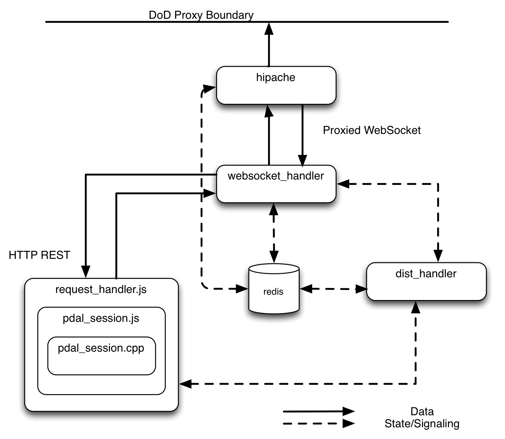

-------------------------------------------------------------------------------
PDAL Data Proxy
-------------------------------------------------------------------------------

:author: Howard Butler
:email: hobu.inc@gmail.com
:author: Uday Verma
:email: uday.karan@gmail.com
:date: 8/24/2013

Synopsis
-------------------------------------------------------------------------------

The PDAL Data Proxy (PDP) is a system of independently scalable servers designed
to hide the implementation of PDAL data sources and allow users to fetch and
interact with remote PDAL-enabled instances over the internet. It utilizes a
number of technologies that are becoming standard operations, such as
`WebSockets`_, `REST APIs`_, and full-stack JavaScript.

Introduction
-------------------------------------------------------------------------------

It is often much more convenient to interact with a server that can abstract and
hide data interaction from a user. One architectural design constraint for the
GRiD project is how to protect clients from a changing layout and arrangement of
the point cloud data stored in Oracle. Without the ability to reorganize the
database, GRiD cannot evolve. Without stability, clients are perpetually in flux.
A typical approach to overcome this scenario is one of "data hiding." Succinctly, a server is placed between the client and database to insulate the client 
from changes in the database and provide more flexibility and intelligence. 

The Problem
-------------------------------------------------------------------------------

GRiD provides access to some 350+ tb of LiDAR point cloud data. Over past couple of years that GRiD has been available, a number of database schema changes have taken place that have provided new capabilities or otherwise allowed the software to evolve. These changes place a burden on clients who connect to the database to fetch data -- they must query data in accordance of the constraints all of these little changes have caused to accumulate.  The PDP will act as a middleman to gloss over these changes and protect clients from having to implement extensive constraint logic to operate the database. The PDP will also interact with the authentication/authorization and the processing queuing systems of GRiD. 

Technology Choices
-------------------------------------------------------------------------------

Open source software development affords a wealth of component choice. This bounty can
be paralyzing, and nowadays, no two software stacks are composed of the same
components simply due this wealth and flexibility. Some guidelines do help constrain
the choices somewhat, however. First is to determine if the choice is well-targeted
for the task at hand. Second is to look for example applications of a technology
choice that mimic the desired use. Third is to the ease at which a candidate component
can be integrated with others.

With these guidelines in mind, a number of new-to-GRiD technologies were chosen to
implement the PDP. Some of these technologies may fit well in other places within
GRiD, but as a whole, the PDP is expected to exist as a mostly stand-alone system. We
can couple it as tightly or as loosely as we want, and leverage its technology in
other ways if we wish, but we are not bound to changing large pieces of GRiD to
support the integration of the PDP.

Software Components
-------------------------------------------------------------------------------

    PDP Server Arrangement
    
`hipache`_
...............................................................................

`hipache`_ is a dynamic WebSocket and HTTP proxy. Its job within the PDP is to 
coordinate access of all external clients to the websocket_handler server(s). As 
websocket_handler instances wake up and register with the dist_handler, their 
port and identity are given to hipache through `redis`_.

dist_handler
...............................................................................

dist_handler is the server registry, and both websocket_handler and request_handler 
instances register with dist_handler to let the system know their availability and 
error status.  dist_handler is also responsible to assign a host and port number to these
services.

websocket_handler
...............................................................................

websocket_handler takes in WebSocket requests and translates them into requests that the 
request_handler can consume.  Any data returned by the request_handler as a request's response is sent back to the client. 
When a websocket_handler is started, it registers itself with dist_handler to notify availability of a new websocket_handler.
The dist_handler, on a successful registration, updates the `redis`_ registry with information about this newly available websocket handler so that the hipache
server can pick up this information and use the websocket handler to handle client requests.

`redis`_
...............................................................................

`redis`_ is a key/value store that is used to manage the identity and port information 
of all of the servers within the PDP. The dist_handler, websocket_handler, and hipache 
all use redis to store information about where to find instances and coordinate 
who is available to accept and respond to requests. 

request_handler
...............................................................................

request_handler is a node.js application that takes in requests from the websocket_handler and passes them down into pdal_session.js. 

pdal_session.js
...............................................................................

pdal_session.js is a node.js module that takes requests from the request_handler and manages interaction with the C/C++ pdal_session.cpp client 
that contains the actual PDAL objects that requests are finally passed to.

.. _`hipache`: https://github.com/dotcloud/hipache
.. _`redis`: http://redis.io/

Creating a Session
-------------------------------------------------------------------------------

A WebSocket request to "create" a session would come into hipache through the DoD's
proxy. Once there, hipache would determine if it has any websocket_handler instances
available to handle the request. If it doesn't, the request will simply block (or
timeout) until one is available. Assuming a websocket_handler is available, it will
ask the dist_handler if a request_handler is available. If not, it will block again.
The request_handler will then eventually translate the request through pdal_session.js down to the pdal_session.cpp, which is a C++ server containing actual PDAL objects that are kept alive and managed throughout the life of the session. 

A response to this "create" request will be a session id that is expected to be used
for all subsequent requests. Finally, a user may "destroy" the session, which will 
tear down the PDAL objects and anything else that is being kept alive to manage that 
particular session.

Reading Data
-------------------------------------------------------------------------------

After creating a session, a "read" request can be given to the infrastructure. The 
response will be a stream of byte data through the WebSocket that is provided to the client by the websocket_handler. 

Operational Scalability
-------------------------------------------------------------------------------

PDP's individual servers are designed to scale independently. The websocket_handler
and request_handler instances can be made available at levels that scale with the
number of incoming requests. The system can be made to conserve i/o resources, or it
can be configured to consume everything available.

.. _`WebSockets`: http://en.wikipedia.org/wiki/WebSocket
.. _`REST APIs`: http://en.wikipedia.org/wiki/Representational_state_transfer

